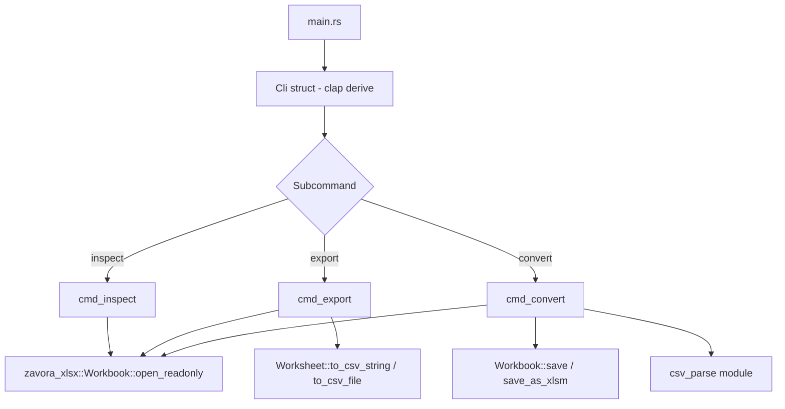

# Design Document: zavora-xlsx-cli

## Overview

`zavora-xlsx-cli` is a command-line tool for inspecting, exporting, and converting Excel `.xlsx` files. It is implemented as a separate binary crate (`zavora-xlsx-cli/`) in the workspace, wrapping the core `zavora-xlsx` library. The tool uses `clap` 4 with derive macros for argument parsing and provides three subcommands:

- **inspect** — Display workbook metadata: sheet names, dimensions, and document properties.
- **export** — Export a single worksheet to CSV or TSV, with configurable delimiter, date format, and output destination.
- **convert** — Convert between xlsx, xlsm, and csv formats, including CSV-to-xlsx with type detection.

The CLI prints errors to stderr and uses exit codes (0 = success, 1 = runtime error, 2 = argument error) for scripting compatibility.

## Architecture



The binary crate has a flat structure with a single `main.rs` file. All logic is organized into handler functions per subcommand. CSV parsing for the `convert` command is implemented as a private module within `main.rs` or a small `csv_parse.rs` helper.

### Crate Layout

```
zavora-xlsx-cli/
├── Cargo.toml
└── src/
    └── main.rs
```

### Dependencies

```toml
[package]
name = "zavora-xlsx-cli"
version = "0.1.0"
edition = "2024"
description = "CLI tool for inspecting, exporting, and converting Excel xlsx files"

[[bin]]
name = "zavora-xlsx"
path = "src/main.rs"

[dependencies]
clap = { version = "4", features = ["derive"] }
zavora-xlsx = { path = ".." }
```

The root `Cargo.toml` adds `"zavora-xlsx-cli"` to the `[workspace]` members list.

## Components and Interfaces

### Clap Argument Structure

```rust
use clap::{Parser, Subcommand};

#[derive(Parser)]
#[command(name = "zavora-xlsx", version, about = "Inspect, export, and convert Excel xlsx files")]
struct Cli {
    #[command(subcommand)]
    command: Commands,
}

#[derive(Subcommand)]
enum Commands {
    /// Inspect an Excel file: show sheet names, dimensions, and metadata
    Inspect {
        /// Path to the xlsx file
        file: String,
    },
    /// Export a worksheet to CSV or TSV
    Export {
        /// Path to the xlsx file
        file: String,
        /// Sheet name to export (default: first sheet)
        #[arg(long)]
        sheet: Option<String>,
        /// Zero-based sheet index to export
        #[arg(long)]
        sheet_index: Option<usize>,
        /// Output file path (default: stdout)
        #[arg(short, long)]
        output: Option<String>,
        /// Field delimiter character (default: comma)
        #[arg(long)]
        delimiter: Option<char>,
        /// Use tab as delimiter (TSV mode)
        #[arg(long)]
        tsv: bool,
        /// Date format string
        #[arg(long)]
        date_format: Option<String>,
    },
    /// Convert between xlsx, xlsm, and csv formats
    Convert {
        /// Path to the input file
        file: String,
        /// Target format: csv, xlsx, xlsm
        #[arg(long)]
        format: String,
        /// Sheet name (for single-sheet csv export)
        #[arg(long)]
        sheet: Option<String>,
        /// Output file or directory path
        #[arg(short, long)]
        output: Option<String>,
        /// Field delimiter for CSV operations
        #[arg(long)]
        delimiter: Option<char>,
    },
}
```

### Subcommand Handlers

#### `cmd_inspect(file: &str) -> Result<(), Box<dyn std::error::Error>>`

1. Opens the file with `Workbook::open_readonly(file)`.
2. Iterates `sheet_names()` and for each sheet calls `worksheet_ref(i)` to get the `used_range()`.
3. Prints sheet count, each sheet's name with row/column dimensions.
4. Prints document properties (`properties()`) — title, author, subject, keywords, category, company — when present.

#### `cmd_export(args) -> Result<(), Box<dyn std::error::Error>>`

1. Opens the file with `Workbook::open_readonly(file)`.
2. Resolves the target sheet: by `--sheet` name, `--sheet-index`, or default to index 0.
3. Builds `CsvOptions` from flags: `--tsv` sets tab delimiter, `--delimiter` overrides, `--date-format` sets date format.
4. If `--output` is provided, calls `worksheet.to_csv_file(path, &options)`.
5. Otherwise, calls `worksheet.to_csv_string(&options)` and writes to stdout.

Note: Since `open_readonly` returns immutable worksheets via `worksheet_ref()`, and `to_csv_string`/`to_csv_file` are methods on `&Worksheet`, we use `worksheet_ref(idx)` for the export path.

#### `cmd_convert(args) -> Result<(), Box<dyn std::error::Error>>`

Handles three conversion paths:

1. **xlsx/xlsm → csv**: Opens with `open_readonly`, exports each sheet (or a single `--sheet`) to CSV files named `<sheet_name>.csv` in the output directory.
2. **csv → xlsx**: Parses the CSV file line-by-line, detects value types (number, boolean, string), writes cells into a new `Workbook`, and saves as `.xlsx`.
3. **xlsx → xlsm**: Opens with `Workbook::open(file)` (edit mode), calls `save_as_xlsm(path, &vba_project)`. Since `save_as_xlsm` requires VBA project bytes, and a plain xlsx has no VBA, this conversion requires a `--vba` flag or produces an error. For the initial implementation, xlsx→xlsm without existing VBA data will return an error explaining that a VBA project is required.

### CSV Parsing (csv → xlsx)

A simple line-by-line parser implemented within the CLI crate:

```rust
fn parse_csv_line(line: &str, delimiter: u8) -> Vec<String> { ... }

fn detect_cell_value(field: &str) -> CellValueType {
    if let Ok(n) = field.parse::<f64>() { return CellValueType::Number(n); }
    match field.to_uppercase().as_str() {
        "TRUE" => CellValueType::Bool(true),
        "FALSE" => CellValueType::Bool(false),
        _ => CellValueType::String(field.to_string()),
    }
}
```

This avoids adding a CSV parsing dependency. The parser handles basic quoting (fields wrapped in double quotes with escaped inner quotes).

## Data Models

### Input/Output Flow

| Subcommand | Input | Output |
|---|---|---|
| `inspect` | `.xlsx` file path | Metadata printed to stdout |
| `export` | `.xlsx` file path + options | CSV/TSV to file or stdout |
| `convert` (xlsx→csv) | `.xlsx` file path | One or more `.csv` files |
| `convert` (csv→xlsx) | `.csv` file path | `.xlsx` file |
| `convert` (xlsx→xlsm) | `.xlsx` file path + VBA data | `.xlsm` file |

### CsvOptions Mapping

| CLI Flag | CsvOptions Field | Default |
|---|---|---|
| `--delimiter <char>` | `delimiter` | `b','` |
| `--tsv` | `delimiter` | `b'\t'` |
| `--date-format <fmt>` | `date_format` | `"yyyy-mm-dd"` |

### Exit Codes

| Code | Meaning |
|---|---|
| 0 | Success |
| 1 | Runtime error (file not found, invalid sheet, I/O error) |
| 2 | Argument parsing error (clap default) |

### CSV Value Detection (csv → xlsx)

| Input Pattern | Detected Type | Workbook Write Method |
|---|---|---|
| Parseable as `f64` | Number | `ws.write(row, col, number)` |
| `TRUE` / `FALSE` (case-insensitive) | Boolean | `ws.write(row, col, bool)` |
| Everything else | String | `ws.write(row, col, string)` |

## Correctness Properties

*A property is a characteristic or behavior that should hold true across all valid executions of a system — essentially, a formal statement about what the system should do. Properties serve as the bridge between human-readable specifications and machine-verifiable correctness guarantees.*

### Property 1: Inspect output completeness

*For any* valid xlsx workbook with N sheets (each having a name and a used range) and any subset of document properties set (title, author, subject, keywords, category, company), running `inspect` SHALL produce output that contains: (a) each sheet name paired with its correct row count and column count, (b) the total sheet count N, and (c) exactly the document properties that are set, with no extra properties printed for unset fields.

**Validates: Requirements 3.2, 3.3, 3.4**

### Property 2: Export sheet selection correctness

*For any* valid xlsx workbook with multiple sheets containing distinct data, and *for any* valid sheet selector (either a sheet name via `--sheet` or a zero-based index via `--sheet-index`), the exported CSV output SHALL contain exactly the data from the selected sheet and no data from other sheets.

**Validates: Requirements 4.2, 4.3**

### Property 3: Export delimiter passthrough

*For any* valid xlsx workbook with multi-column data and *for any* single-byte delimiter character, exporting with `--delimiter <char>` SHALL produce CSV output where fields on each line are separated by exactly that delimiter character.

**Validates: Requirements 4.6**

### Property 4: Convert xlsx-to-csv file naming

*For any* valid xlsx workbook with N sheets (each having a unique name), converting to CSV format without `--sheet` SHALL produce exactly N files, where each file is named `<sheet_name>.csv` and contains the CSV representation of that sheet's data.

**Validates: Requirements 5.1**

### Property 5: CSV-to-xlsx data round-trip

*For any* CSV file containing a mix of numeric values, boolean values (TRUE/FALSE, case-insensitive), and string values, converting to xlsx and then reading back the resulting workbook SHALL preserve all cell values with correct types: numbers as `Number`, booleans as `Bool`, and strings as `String`.

**Validates: Requirements 5.3, 7.2, 7.3, 7.4**

### Property 6: Output filename derivation

*For any* input filename with a recognized extension (.xlsx, .xlsm, .csv) and *for any* compatible target format, when no `--output` option is provided, the derived output filename SHALL equal the input filename with its extension replaced by the target format's extension.

**Validates: Requirements 5.6**

### Property 7: CSV custom delimiter parsing

*For any* CSV file using a non-comma single-byte delimiter and *for any* tabular data, converting to xlsx with `--delimiter <char>` matching the file's delimiter SHALL correctly split fields and produce a workbook with the same column count and cell values as the original data.

**Validates: Requirements 7.5**

## Error Handling

All errors follow a consistent pattern:

1. **File not found / unreadable**: When `Workbook::open_readonly` or file I/O fails, the error is caught, a descriptive message is printed to stderr via `eprintln!`, and the process exits with code 1.

2. **Sheet not found**: When `--sheet <name>` or `--sheet-index <n>` refers to a non-existent sheet, the handler prints an error like `"Error: sheet 'Foo' not found in workbook"` to stderr and exits with code 1.

3. **Incompatible format**: When the input format doesn't support the target conversion (e.g., xlsx→xlsm without VBA data), the handler prints a descriptive error and exits with code 1.

4. **Argument errors**: Clap handles invalid subcommands and missing required arguments automatically, printing usage help to stderr and exiting with code 2.

### Error Flow

```rust
fn main() {
    let cli = Cli::parse();
    let result = match cli.command {
        Commands::Inspect { file } => cmd_inspect(&file),
        Commands::Export { .. } => cmd_export(/* args */),
        Commands::Convert { .. } => cmd_convert(/* args */),
    };
    if let Err(e) = result {
        eprintln!("Error: {e}");
        std::process::exit(1);
    }
}
```

Each `cmd_*` function returns `Result<(), Box<dyn std::error::Error>>`. The `zavora_xlsx::Error` type implements `Display`, so error messages are descriptive by default. Additional context is added where needed (e.g., `"sheet 'X' not found"`).

## Testing Strategy

### Unit Tests

Unit tests cover specific examples, edge cases, and error conditions:

- **Argument parsing**: Verify clap parses valid arguments and rejects invalid ones (no-args shows help, --help exits 0, --version exits 0, invalid subcommand exits 2).
- **CSV value detection**: Test specific examples — `"42"` → Number, `"3.14"` → Number, `"true"` → Bool, `"FALSE"` → Bool, `"hello"` → String, `""` → String.
- **CSV line parsing**: Test quoting rules — fields with commas, fields with quotes, fields with newlines, empty fields.
- **Output filename derivation**: Test `"report.xlsx"` + csv → `"report.csv"`, `"data.csv"` + xlsx → `"data.xlsx"`.
- **Error cases**: Non-existent file, non-existent sheet name, invalid sheet index, incompatible format conversion.

### Property-Based Tests

Property-based tests verify universal properties across generated inputs. The CLI crate will use the `proptest` library for Rust.

**Configuration:**
- Minimum 100 iterations per property test
- Each test is tagged with a comment referencing the design property

**Tag format:** `// Feature: cli-tool, Property {number}: {title}`

**Properties to implement:**
1. Inspect output completeness (Property 1)
2. Export sheet selection correctness (Property 2)
3. Export delimiter passthrough (Property 3)
4. Convert xlsx-to-csv file naming (Property 4)
5. CSV-to-xlsx data round-trip (Property 5)
6. Output filename derivation (Property 6)
7. CSV custom delimiter parsing (Property 7)

### Integration Tests

Integration tests run the compiled binary as a subprocess and verify end-to-end behavior:

- **inspect**: Run on a known xlsx fixture, verify output format and content.
- **export**: Run with various flag combinations, verify CSV output matches expected data.
- **convert**: Run xlsx→csv and csv→xlsx conversions, verify output files.
- **error paths**: Run with bad inputs, verify stderr output and exit codes.

### Test Dependencies

```toml
[dev-dependencies]
proptest = "1"
tempfile = "3"
assert_cmd = "2"       # for integration tests running the binary
predicates = "3"       # for assertion helpers
```

