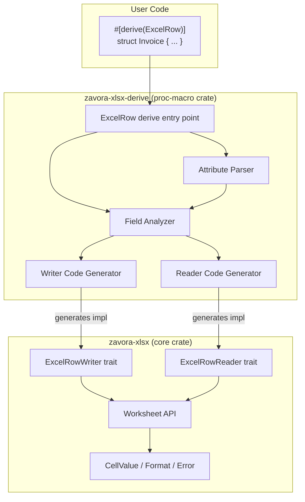

# Design Document: zavora-xlsx-derive

## Overview

The `zavora-xlsx-derive` crate provides a `#[derive(ExcelRow)]` procedural macro that generates `ExcelRowWriter` and `ExcelRowReader` trait implementations for named Rust structs. This is a serde-free alternative to the existing `serde_support` module — it generates code that directly calls the zavora-xlsx cell-level API (`ws.write()`, `ws.read_cell()`), avoiding the overhead and complexity of serde's trait machinery.

The macro lives in a separate workspace member (`zavora-xlsx-derive/`) because proc-macro crates must be compiled with `proc-macro = true`. The two traits it implements (`ExcelRowWriter`, `ExcelRowReader`) are defined in the core `zavora-xlsx` crate so that downstream code depends only on stable trait definitions at runtime.

### Design Rationale

The existing `serde_support` module works well for users already using serde, but it has drawbacks:
- Requires the `serde` dependency and feature flag
- Uses runtime reflection (field name discovery via `Serialize`) rather than compile-time code generation
- Cannot express Excel-specific concepts like `#[excel(format = "...")]` without a separate attribute layer
- Error messages from serde deserialization are generic, not Excel-aware

The derive macro approach generates direct, zero-abstraction code at compile time. Each field maps to a known column index, and the generated code calls `ws.write()` / `ws.read_cell()` directly with the correct types.

## Architecture



### Crate Boundary

The proc-macro crate (`zavora-xlsx-derive`) exports exactly one item: the `ExcelRow` derive macro. It has no runtime dependency on `zavora-xlsx`. The generated code references `zavora_xlsx::` paths, which are resolved when the user's crate compiles.

```
zavora-xlsx-derive/
├── Cargo.toml          # proc-macro = true, depends on syn/quote/proc-macro2
└── src/
    └── lib.rs          # #[proc_macro_derive(ExcelRow, attributes(excel))]
                        # Contains: entry point, attribute parsing, field analysis,
                        # writer codegen, reader codegen
```

The core crate (`zavora-xlsx`) defines the traits and re-exports them:

```rust
// In zavora-xlsx src/lib.rs (new additions)
pub trait ExcelRowWriter {
    fn write_header(&self, ws: &mut Worksheet, row: RowNum) -> Result<()>;
    fn write_row(&self, ws: &mut Worksheet, row: RowNum) -> Result<()>;
}

pub trait ExcelRowReader: Sized {
    fn read_row(ws: &Worksheet, row: RowNum, headers: &[String]) -> Result<Self>;
}
```

### Processing Pipeline

The derive macro processes a struct through these stages:

1. **Parse**: `syn::parse_macro_input!` parses the `DeriveInput`
2. **Validate**: Reject non-struct items (enums, unions, tuple structs, unit structs)
3. **Extract fields**: Iterate `Fields::Named`, collecting field name, type, and attributes
4. **Parse attributes**: For each field, parse `#[excel(...)]` into `FieldConfig` (header, format, skip)
5. **Assign columns**: Non-skipped fields get sequential 0-based column indices
6. **Generate writer**: Emit `impl ExcelRowWriter` with `write_header` and `write_row`
7. **Generate reader**: Emit `impl ExcelRowReader` with `read_row`
8. **Combine**: Return the combined `TokenStream`

## Components and Interfaces

### 1. Derive Entry Point

```rust
#[proc_macro_derive(ExcelRow, attributes(excel))]
pub fn derive_excel_row(input: TokenStream) -> TokenStream {
    let input = syn::parse_macro_input!(input as syn::DeriveInput);
    match impl_excel_row(&input) {
        Ok(tokens) => tokens.into(),
        Err(err) => err.to_compile_error().into(),
    }
}
```

The `attributes(excel)` declaration tells the compiler that `#[excel(...)]` attributes on fields are consumed by this macro and should not trigger "unknown attribute" errors.

### 2. Attribute Parser

Parses `#[excel(header = "...", format = "...", skip)]` from field attributes.

```rust
struct FieldConfig {
    header: Option<String>,    // Custom header text
    format: Option<String>,    // Number format string
    skip: bool,                // Exclude from Excel I/O
}

fn parse_field_attrs(attrs: &[syn::Attribute]) -> syn::Result<FieldConfig> {
    // Iterates attrs, filters for path == "excel",
    // parses Meta::List contents as comma-separated key=value pairs and flags
    // Validates: no unknown keys, no non-string values for header/format,
    // skip not combined with header/format
}
```

Attribute parsing uses `syn::meta::ParseNestedMeta` (syn 2.x API) to iterate over the comma-separated items inside `#[excel(...)]`. Each item is matched:
- `header = "..."` → `FieldConfig.header = Some(lit_str.value())`
- `format = "..."` → `FieldConfig.format = Some(lit_str.value())`
- `skip` → `FieldConfig.skip = true`
- Anything else → `syn::Error` with span pointing to the unrecognized token

### 3. Field Analyzer

Inspects each field's type to determine the code generation strategy.

```rust
struct FieldInfo {
    ident: syn::Ident,         // Field name
    ty: syn::Type,             // Full type
    config: FieldConfig,       // Parsed attributes
    col_index: u16,            // Assigned column (for non-skipped fields)
    is_option: bool,           // Whether the outer type is Option<T>
    inner_type: Option<syn::Type>, // The T in Option<T>, if applicable
}
```

**Option detection**: The analyzer checks if the field type is `Option<T>` by matching the type path's last segment against `"Option"` and extracting the generic argument. This handles `Option<T>`, `std::option::Option<T>`, and `core::option::Option<T>`.

### 4. Writer Code Generator

Generates the `ExcelRowWriter` implementation.

**`write_header`** — for each non-skipped field, emits:
```rust
ws.write(row, COL, "header_text")?;
```
Where `header_text` is either the `#[excel(header = "...")]` value or the field name.

**`write_row`** — for each non-skipped field, emits code based on type and attributes:

| Field Type | No Format | With Format |
|---|---|---|
| `String` | `ws.write(row, col, &self.field)?;` | `ws.write_with_format(row, col, &self.field, &fmt)?;` |
| Numeric (`f64`, `i32`, etc.) | `ws.write(row, col, self.field)?;` | `ws.write_with_format(row, col, self.field, &fmt)?;` |
| `bool` | `ws.write(row, col, self.field)?;` | `ws.write_with_format(row, col, self.field, &fmt)?;` |
| `Option<String>` (Some) | `ws.write(row, col, v)?;` | `ws.write_with_format(row, col, v, &fmt)?;` |
| `Option<T>` (None) | *(skip — no write)* | *(skip — no write)* |

When a format attribute is present, the generated code creates the format inline:
```rust
let __fmt_N = zavora_xlsx::Format::new().num_format("...");
```

### 5. Reader Code Generator

Generates the `ExcelRowReader` implementation.

**`read_row`** — the generated code:
1. For each non-skipped field, finds the column index by searching the `headers` slice for the field's header name
2. Reads the cell value with `ws.read_cell(row, col_index)`
3. Converts the `CellValue` to the target Rust type
4. For skipped fields, uses `Default::default()`

**Type conversion logic** (generated as match arms on `CellValue`):

| Target Type | CellValue::String | CellValue::Number | CellValue::Bool | CellValue::Empty |
|---|---|---|---|---|
| `String` | `s.clone()` | `n.to_string()` | `b.to_string()` | `String::new()` |
| `f64` / `f32` | parse or error | `n` / `n as f32` | error | error |
| `i8`..`i64`, `u8`..`u64` | parse or error | `n as T` | error | error |
| `bool` | error | error | `b` | error |
| `Option<T>` | `Some(convert(v))` | `Some(convert(v))` | `Some(convert(v))` | `None` |

Errors are returned as `zavora_xlsx::Error::InvalidData(msg)` with context: field name, expected type, actual variant.

## Data Models

### FieldConfig (compile-time)

```rust
/// Configuration extracted from #[excel(...)] attributes on a single field.
struct FieldConfig {
    /// Custom column header. None = use field name.
    header: Option<String>,
    /// Number format string for write_with_format. None = no formatting.
    format: Option<String>,
    /// If true, field is excluded from Excel I/O and populated with Default::default() on read.
    skip: bool,
}
```

### FieldInfo (compile-time)

```rust
/// Complete analysis of a single struct field for code generation.
struct FieldInfo {
    /// The field's identifier (e.g., `amount`).
    ident: syn::Ident,
    /// The field's full type (e.g., `Option<f64>`).
    ty: syn::Type,
    /// Parsed attribute configuration.
    config: FieldConfig,
    /// 0-based column index assigned to this field (only meaningful if !config.skip).
    col_index: u16,
    /// Whether the field type is Option<T>.
    is_option: bool,
    /// The inner type T if is_option is true.
    inner_type: Option<syn::Type>,
}
```

### ExcelRowWriter Trait (runtime, defined in core crate)

```rust
pub trait ExcelRowWriter {
    /// Write column headers to the specified row.
    fn write_header(&self, ws: &mut Worksheet, row: RowNum) -> Result<()>;
    /// Write field values to the specified row.
    fn write_row(&self, ws: &mut Worksheet, row: RowNum) -> Result<()>;
}
```

### ExcelRowReader Trait (runtime, defined in core crate)

```rust
pub trait ExcelRowReader: Sized {
    /// Read a row from the worksheet and construct a struct instance.
    /// `headers` is a slice of column header strings used to map field names to column indices.
    fn read_row(ws: &Worksheet, row: RowNum, headers: &[String]) -> Result<Self>;
}
```

### CellValue (existing, used by generated read code)

```rust
pub enum CellValue {
    Empty,
    String(String),
    Number(f64),
    Bool(bool),
    DateTime(ExcelDateTime),
    Error(String),
    Formula { formula: String, cached_value: Box<CellValue> },
    RichText(RichText),
}
```

## Correctness Properties

*A property is a characteristic or behavior that should hold true across all valid executions of a system — essentially, a formal statement about what the system should do. Properties serve as the bridge between human-readable specifications and machine-verifiable correctness guarantees.*

### Property 1: Write-read round trip preserves field values

*For any* named struct with an arbitrary mix of supported field types (`String`, `f64`, `f32`, `i8`–`i64`, `u8`–`u64`, `bool`, `Option<T>` of any of these), and *for any* valid field values, writing the struct with `write_header` + `write_row` and then reading it back with `read_row` (using the written headers) SHALL produce a struct whose non-skipped field values are equal to the original (with numeric types subject to `f64` round-trip precision).

**Validates: Requirements 2.1, 2.3, 3.1, 3.2, 3.3, 4.1, 4.2, 4.3, 4.4, 4.5, 4.6, 5.1, 5.2, 5.3, 5.4, 5.5, 5.6**

### Property 2: Skipped fields are excluded from Excel and default on read

*For any* struct where some fields are annotated with `#[excel(skip)]`, the number of headers written by `write_header` SHALL equal the number of non-skipped fields, skipped fields SHALL not consume any column, and after `read_row` the skipped fields SHALL have their `Default::default()` values.

**Validates: Requirements 6.1, 6.2**

### Property 3: Missing header produces error with header name

*For any* struct and *for any* subset of its expected headers that is missing at least one required (non-skipped, non-Option) field's header, calling `read_row` with that incomplete header slice SHALL return an `Err` whose message contains the name of the missing header.

**Validates: Requirements 9.1**

### Property 4: Type mismatch produces descriptive error

*For any* struct field with a non-String, non-Option type, and *for any* `CellValue` variant that is incompatible with that field's type (e.g., `CellValue::String("abc")` for a `bool` field), calling `read_row` SHALL return an `Err(zavora_xlsx::Error::InvalidData(msg))` where `msg` contains the field name, the expected type description, and the actual `CellValue` variant name.

**Validates: Requirements 5.7, 9.2, 9.3**

### Property 5: Header column order independence

*For any* struct and *for any* permutation of its column headers, `read_row` SHALL produce the same struct values regardless of header order — the reader maps fields to columns by header name, not by position.

**Validates: Requirements 5.8**

## Error Handling

### Compile-Time Errors (proc-macro phase)

The derive macro produces `syn::Error` compile-time errors for:

| Condition | Error Message |
|---|---|
| Applied to enum, tuple struct, or unit struct | `"ExcelRow can only be derived for named structs"` |
| Unrecognized attribute key | `"unknown excel attribute: '{key}'"` |
| `header` value is not a string literal | `"'header' value must be a string literal"` |
| `format` value is not a string literal | `"'format' value must be a string literal"` |
| `skip` combined with `header` or `format` | `"'skip' cannot be combined with other excel attributes"` |

All errors include the `Span` of the offending token so the compiler points to the exact location.

### Runtime Errors (read_row phase)

All runtime errors are returned as `zavora_xlsx::Error::InvalidData(String)`. The generated `read_row` code produces errors in two cases:

1. **Missing header**: When a required field's header name is not found in the `headers` slice.
   - Format: `"missing column header '{header_name}' for field '{field_name}'"`

2. **Type mismatch**: When a cell value cannot be converted to the target field type.
   - Format: `"field '{field_name}': expected {type_desc}, got {cell_variant}"`
   - Example: `"field 'amount': expected numeric value, got String(\"abc\")"`

For `Option<T>` fields, a missing header is not an error — the field is set to `None`. Similarly, `CellValue::Empty` for an `Option<T>` field produces `None`, not an error.

### Write Errors

The generated `write_header` and `write_row` methods propagate any `zavora_xlsx::Result` errors from the underlying `ws.write()` and `ws.write_with_format()` calls. These are typically I/O errors and are not modified by the generated code.

## Testing Strategy

### Test Framework

- **Unit/integration tests**: Standard Rust `#[test]` in the `zavora-xlsx-derive` crate's `tests/` directory
- **Compile-fail tests**: [`trybuild`](https://crates.io/crates/trybuild) for verifying compile-time error messages
- **Property-based tests**: [`proptest`](https://crates.io/crates/proptest) for randomized input generation

### Property-Based Tests

Property-based tests use `proptest` with a minimum of 100 iterations per property. Each test is tagged with its design property reference.

| Property | Test Description | Generator Strategy |
|---|---|---|
| Property 1 (round trip) | Generate random field values for a fixed set of test structs, write then read, compare | `proptest` strategies for `String`, numeric types, `bool`, `Option<T>` |
| Property 2 (skip) | Use test structs with skip fields, verify header count and default values | Reuse value generators, verify skipped fields |
| Property 3 (missing header) | Generate random subsets of headers with removals, verify error messages | `proptest::sample::subsequence` on header list |
| Property 4 (type mismatch) | Generate incompatible CellValue variants for typed fields, verify error content | Custom strategy pairing field types with wrong CellValue variants |
| Property 5 (header permutation) | Generate random permutations of headers, verify read produces same result | `proptest::collection::vec` with shuffle |

Since proc macros run at compile time, property tests operate on **fixed test structs** compiled with `#[derive(ExcelRow)]` and randomize the **runtime data** (field values, header orderings, cell contents). The test structs cover the type matrix:

```rust
#[derive(ExcelRow, Debug, PartialEq)]
struct AllTypes {
    name: String,
    count: u32,
    amount: f64,
    active: bool,
    #[excel(header = "Notes")]
    notes: Option<String>,
    #[excel(skip)]
    internal: String,
}
```

**Tag format**: `// Feature: derive-macro, Property {N}: {property_text}`

### Example-Based Tests

| Test | Validates |
|---|---|
| Derive on tuple struct → compile error | Req 2.2 |
| Derive on unit struct → compile error | Req 2.2 |
| Derive on enum → compile error | Req 2.2 |
| Unknown attribute key → compile error | Req 7.1 |
| Non-string header value → compile error | Req 7.2 |
| Non-string format value → compile error | Req 7.3 |
| Combined header + format works | Req 7.4 |
| skip + header → compile error | Req 7.5 |
| skip + format → compile error | Req 7.5 |
| Skip field without Default → compile error | Req 6.3 |
| Format attribute applies num_format | Req 4.7 |

### Integration Tests

- Write multiple rows of derived structs, save to `.xlsx`, reopen, read back, verify all data
- Verify trait definitions exist and are importable from `zavora_xlsx` (Req 8.1–8.4)

### Test Dependencies

```toml
[dev-dependencies]
proptest = "1"
trybuild = "1"
zavora-xlsx = { path = ".." }
```

