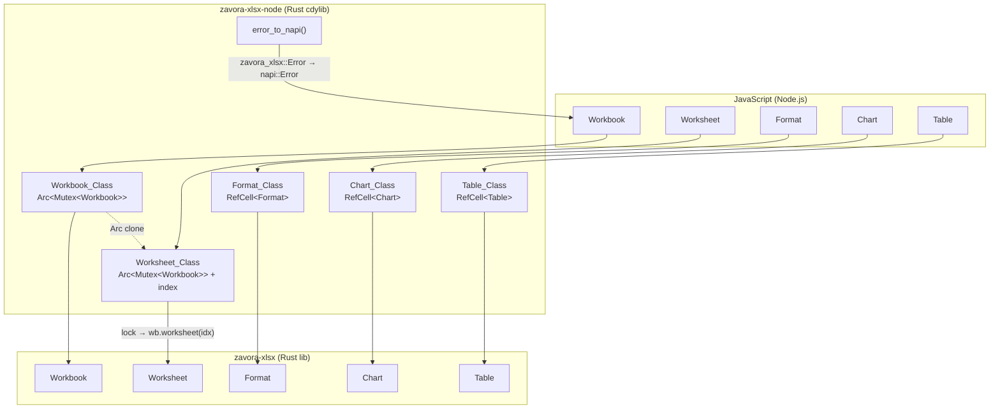

# Design Document: node-bindings

## Overview

This design describes `zavora-xlsx-node`, a Node.js native addon that wraps the `zavora-xlsx` Rust library using napi-rs (v2). The addon exposes five primary JavaScript classes — `Workbook`, `Worksheet`, `Format`, `Chart`, and `Table` — that map to their Rust counterparts. The crate lives in `zavora-xlsx-node/` as a workspace member and compiles to a `.node` cdylib via `napi build`.

The central design challenge is ownership: Rust's `Workbook` owns its `Worksheet` vec, but JavaScript needs independent handles to worksheets that outlive any single method call. We solve this with `Arc<Mutex<Workbook>>` shared between the `Workbook` JS class and every `Worksheet` JS class it hands out. `Format`, `Chart`, and `Table` are value types — each JS instance owns its Rust struct directly with no shared state.

## Architecture



### Ownership Model

| JS Class | Rust Wrapper | Why |
|---|---|---|
| `Workbook` | `Arc<Mutex<zavora_xlsx::Workbook>>` | Shared with all Worksheet handles; Mutex for interior mutability |
| `Worksheet` | `Arc<Mutex<zavora_xlsx::Workbook>>` + `usize` (sheet index) | Borrows into the workbook on each method call via lock + index |
| `Format` | `RefCell<zavora_xlsx::Format>` | Value type, single owner, needs `&mut` for builder methods on `&self` napi methods |
| `Chart` | `RefCell<zavora_xlsx::Chart>` | Value type, single owner |
| `Table` | `RefCell<zavora_xlsx::Table>` | Value type, single owner |

The `Arc<Mutex<>>` pattern for Workbook/Worksheet is necessary because:
1. napi-rs classes are moved into the JS GC — we cannot hand out Rust references with lifetimes
2. Multiple `Worksheet` JS objects may exist simultaneously, all pointing into the same workbook
3. The Mutex ensures safe concurrent access (though Node.js is single-threaded, napi-rs requires `Send`)

`Format`, `Chart`, and `Table` use `RefCell` because napi-rs `#[napi]` methods take `&self`, but the builder pattern requires `&mut self`. `RefCell` provides interior mutability without the overhead of a Mutex for these single-owner types.

### Crate Layout

```
zavora-xlsx-node/
├── Cargo.toml
├── build.rs
├── package.json
├── src/
│   ├── lib.rs          # Module declarations, re-exports
│   ├── workbook.rs     # Workbook_Class
│   ├── worksheet.rs    # Worksheet_Class
│   ├── format.rs       # Format_Class
│   ├── chart.rs        # Chart_Class
│   ├── table.rs        # Table_Class
│   └── error.rs        # zavora_xlsx::Error → napi::Error conversion
└── __test__/
    └── index.spec.mjs  # JS-side integration tests
```

## Components and Interfaces

### error.rs — Error Conversion

```rust
use napi::Error as NapiError;
use napi::Status;

/// Convert a zavora_xlsx::Error into a napi::Error.
pub fn to_napi_error(e: zavora_xlsx::Error) -> NapiError {
    NapiError::new(Status::GenericFailure, format!("{e}"))
}

/// Shorthand: convert Result<T, zavora_xlsx::Error> to napi::Result<T>.
pub trait IntoNapi<T> {
    fn into_napi(self) -> napi::Result<T>;
}

impl<T> IntoNapi<T> for Result<T, zavora_xlsx::Error> {
    fn into_napi(self) -> napi::Result<T> {
        self.map_err(to_napi_error)
    }
}
```

### workbook.rs — Workbook_Class

```rust
use std::sync::{Arc, Mutex};
use napi::bindgen_prelude::*;
use napi_derive::napi;

#[napi]
pub struct Workbook {
    inner: Arc<Mutex<zavora_xlsx::Workbook>>,
}

#[napi]
impl Workbook {
    #[napi(constructor)]
    pub fn new() -> Self;

    #[napi(factory)]
    pub fn open(path: String) -> napi::Result<Self>;

    #[napi(factory)]
    pub fn open_from_buffer(buffer: Buffer) -> napi::Result<Self>;

    #[napi]
    pub fn save(&self, path: String) -> napi::Result<()>;

    #[napi]
    pub fn save_to_buffer(&self) -> napi::Result<Buffer>;

    #[napi]
    pub fn worksheet(&self, index: u32) -> napi::Result<Worksheet>;

    #[napi]
    pub fn add_worksheet(&self) -> napi::Result<Worksheet>;

    #[napi]
    pub fn add_worksheet_with_name(&self, name: String) -> napi::Result<Worksheet>;

    #[napi]
    pub fn sheet_names(&self) -> napi::Result<Vec<String>>;

    #[napi]
    pub fn sheet_count(&self) -> napi::Result<u32>;

    #[napi]
    pub fn set_properties(&self, props: DocPropertiesJs) -> napi::Result<()>;

    #[napi]
    pub fn properties(&self) -> napi::Result<DocPropertiesJs>;
}
```

### worksheet.rs — Worksheet_Class

```rust
#[napi]
pub struct Worksheet {
    workbook: Arc<Mutex<zavora_xlsx::Workbook>>,
    index: usize,
}

#[napi]
impl Worksheet {
    // Cell writing
    #[napi]
    pub fn write_string(&self, row: u32, col: u16, value: String,
                        format: Option<&Format>) -> napi::Result<()>;

    #[napi]
    pub fn write_number(&self, row: u32, col: u16, value: f64,
                        format: Option<&Format>) -> napi::Result<()>;

    #[napi]
    pub fn write_boolean(&self, row: u32, col: u16, value: bool,
                         format: Option<&Format>) -> napi::Result<()>;

    #[napi]
    pub fn write_formula(&self, row: u32, col: u16, formula: String,
                         format: Option<&Format>) -> napi::Result<()>;

    #[napi]
    pub fn write_blank(&self, row: u32, col: u16, format: &Format) -> napi::Result<()>;

    // Cell reading
    #[napi]
    pub fn read_cell(&self, row: u32, col: u16) -> napi::Result<JsUnknown>;

    #[napi]
    pub fn used_range(&self) -> napi::Result<Option<UsedRangeResult>>;

    // Layout
    #[napi]
    pub fn set_column_width(&self, col: u16, width: f64) -> napi::Result<()>;

    #[napi]
    pub fn set_row_height(&self, row: u32, height: f64) -> napi::Result<()>;

    #[napi]
    pub fn set_freeze_panes(&self, row: u32, col: u16) -> napi::Result<()>;

    #[napi]
    pub fn merge_range(&self, r1: u32, c1: u16, r2: u32, c2: u16,
                       text: String, format: Option<&Format>) -> napi::Result<()>;

    #[napi]
    pub fn autofit(&self) -> napi::Result<()>;

    #[napi]
    pub fn set_zoom(&self, percent: u16) -> napi::Result<()>;

    // Features
    #[napi]
    pub fn insert_chart(&self, row: u32, col: u16, chart: &Chart) -> napi::Result<()>;

    #[napi]
    pub fn add_table(&self, first_row: u32, first_col: u16, last_row: u32,
                     last_col: u16, table: &Table) -> napi::Result<()>;

    // CSV export
    #[napi]
    pub fn to_csv_string(&self, options: Option<CsvOptionsJs>) -> napi::Result<String>;

    // Name
    #[napi]
    pub fn name(&self) -> napi::Result<String>;

    #[napi]
    pub fn set_name(&self, name: String) -> napi::Result<()>;
}
```

### format.rs — Format_Class

```rust
use std::cell::RefCell;

#[napi]
pub struct Format {
    inner: RefCell<zavora_xlsx::Format>,
}

#[napi]
impl Format {
    #[napi(constructor)]
    pub fn new() -> Self;

    // Each builder method borrows inner mutably via RefCell, applies the
    // change, and returns a reference to &self for JS-side chaining.
    // napi-rs supports returning `&Self` or `this` for chaining.
    #[napi]
    pub fn bold(&self) -> &Self;
    #[napi]
    pub fn italic(&self) -> &Self;
    #[napi]
    pub fn underline(&self, style: String) -> &Self;
    #[napi]
    pub fn strikethrough(&self) -> &Self;
    #[napi]
    pub fn font_size(&self, size: f64) -> &Self;
    #[napi]
    pub fn font_name(&self, name: String) -> &Self;
    #[napi]
    pub fn font_color(&self, hex: String) -> &Self;
    #[napi]
    pub fn background_color(&self, hex: String) -> &Self;
    #[napi]
    pub fn num_format(&self, format: String) -> &Self;
    #[napi]
    pub fn border(&self, style: String) -> &Self;
    #[napi]
    pub fn align(&self, alignment: String) -> &Self;
    #[napi]
    pub fn text_wrap(&self) -> &Self;
    #[napi]
    pub fn shrink_to_fit(&self) -> &Self;
    #[napi]
    pub fn indent(&self, level: u8) -> &Self;
    #[napi]
    pub fn rotation(&self, angle: i16) -> &Self;
}
```

### chart.rs — Chart_Class

```rust
#[napi]
pub struct Chart {
    inner: RefCell<zavora_xlsx::Chart>,
}

#[napi]
impl Chart {
    #[napi(constructor)]
    pub fn new(chart_type: String) -> napi::Result<Self>;

    #[napi]
    pub fn add_series(&self, values: String, categories: Option<String>,
                      name: Option<String>) -> &Self;

    #[napi]
    pub fn set_title(&self, title: String) -> &Self;

    #[napi]
    pub fn set_x_axis_name(&self, name: String) -> &Self;

    #[napi]
    pub fn set_y_axis_name(&self, name: String) -> &Self;

    #[napi]
    pub fn set_size(&self, width: u32, height: u32) -> &Self;

    #[napi]
    pub fn set_legend_position(&self, position: String) -> &Self;
}
```

**Chart type string mapping:**

| JS string | Rust `ChartType` |
|---|---|
| `"bar"` | `ChartType::Bar` |
| `"column"` | `ChartType::Column` |
| `"line"` | `ChartType::Line` |
| `"pie"` | `ChartType::Pie` |
| `"scatter"` | `ChartType::Scatter` |
| `"area"` | `ChartType::Area` |
| `"doughnut"` | `ChartType::Doughnut` |
| `"radar"` | `ChartType::Radar` |

Unrecognized strings produce `napi::Error` with status `InvalidArg`.

### table.rs — Table_Class

```rust
#[napi]
pub struct Table {
    inner: RefCell<zavora_xlsx::Table>,
}

#[napi]
impl Table {
    #[napi(constructor)]
    pub fn new() -> Self;

    #[napi]
    pub fn set_columns(&self, columns: Vec<TableColumnJs>) -> &Self;

    #[napi]
    pub fn set_style(&self, style: String) -> &Self;

    #[napi]
    pub fn set_total_row(&self, enabled: bool) -> &Self;

    #[napi]
    pub fn set_autofilter(&self, enabled: bool) -> &Self;

    #[napi]
    pub fn set_name(&self, name: String) -> &Self;
}
```

**`TableColumnJs` interface (napi object):**

```typescript
interface TableColumnJs {
    name: string;
    totalLabel?: string;
    totalFunction?: string;
}
```

## Data Models

### CellValue Mapping (Rust → JavaScript)

| Rust `CellValue` | JavaScript value | Notes |
|---|---|---|
| `CellValue::String(s)` | `string` | Direct mapping |
| `CellValue::Number(n)` | `number` | f64 → JS number |
| `CellValue::Bool(b)` | `boolean` | Direct mapping |
| `CellValue::Empty` | `null` | Represents blank cells |
| `CellValue::DateTime(dt)` | `number` | Excel serial date as f64 |
| `CellValue::Error(e)` | `string` | Error string like `"#REF!"` |
| `CellValue::Formula { formula, cached_value }` | `{ formula: string, cachedValue: string \| number \| boolean \| null }` | Object with formula text and recursively mapped cached value |
| `CellValue::RichText(rt)` | `string` | Plain text extraction via `rt.plain_text()` |

### DocPropertiesJs (napi object)

```typescript
interface DocPropertiesJs {
    title?: string;
    author?: string;
    subject?: string;
    description?: string;
    keywords?: string;
    category?: string;
    company?: string;
}
```

### CsvOptionsJs (napi object)

```typescript
interface CsvOptionsJs {
    delimiter?: string;   // Single character, default ","
    quote?: string;       // Single character, default '"'
    lineEnding?: string;  // Default "\r\n"
    dateFormat?: string;  // Default "yyyy-mm-dd"
}
```

The `delimiter` and `quote` JS strings are converted to `u8` by taking the first byte. Invalid (empty) strings produce an error.

### UsedRangeResult (napi object)

```typescript
interface UsedRangeResult {
    firstRow: number;
    firstCol: number;
    lastRow: number;
    lastCol: number;
}
```

### String-to-Enum Mappings

**Border styles:** `"none"`, `"thin"`, `"medium"`, `"thick"`, `"double"`, `"hair"`, `"dashed"`, `"dotted"` → `BorderStyle::*`

**Underline styles:** `"single"`, `"double"`, `"singleAccounting"`, `"doubleAccounting"` → `Underline::*`

**Alignment:** `"left"`, `"center"`, `"right"`, `"fill"`, `"justify"`, `"top"`, `"middle"`, `"bottom"` → `Align::*`

**Legend position:** `"bottom"`, `"top"`, `"left"`, `"right"`, `"none"` → `LegendPosition::*`

**Table style:** Parsed from strings like `"TableStyleLight1"`, `"TableStyleMedium5"`, `"TableStyleDark3"` → `TableStyle::Light(1)`, `TableStyle::Medium(5)`, `TableStyle::Dark(3)`

## Correctness Properties

*A property is a characteristic or behavior that should hold true across all valid executions of a system — essentially, a formal statement about what the system should do. Properties serve as the bridge between human-readable specifications and machine-verifiable correctness guarantees.*

### Property 1: Cell write/read round-trip

*For any* cell value type (string, number, boolean, or formula) and any valid (row, col) position, writing the value to a worksheet cell and then reading it back with `readCell` should return an equivalent value: strings match exactly, numbers match exactly, booleans match exactly, and formulas return an object whose `formula` field matches the written formula string.

**Validates: Requirements 4.1, 4.2, 4.3, 4.4, 5.1, 5.2, 5.3, 5.5**

### Property 2: Buffer save/load round-trip

*For any* workbook containing arbitrary cell data (strings, numbers, booleans) across one or more worksheets, calling `saveToBuffer()` and then `Workbook.openFromBuffer()` on the resulting buffer should produce a workbook where every previously written cell returns the same value via `readCell`.

**Validates: Requirements 2.3, 2.7**

### Property 3: addWorksheet increments sheet count

*For any* positive integer N, starting from a new workbook (sheetCount = 1) and calling `addWorksheet()` N times should result in `sheetCount()` returning exactly 1 + N.

**Validates: Requirements 3.3, 3.6**

### Property 4: Worksheet name preservation on creation

*For any* valid Excel sheet name (1–31 characters, no `:/\?*[]` characters), calling `addWorksheetWithName(name)` should produce a worksheet where `name()` returns exactly the provided name, and `sheetNames()` includes that name.

**Validates: Requirements 3.4, 3.5, 13.1**

### Property 5: Worksheet rename round-trip

*For any* valid Excel sheet name, calling `setName(name)` on a worksheet and then calling `name()` should return exactly the provided name.

**Validates: Requirements 13.2**

### Property 6: usedRange encompasses all written cells

*For any* non-empty set of (row, col) positions where values have been written, `usedRange()` should return a range where `firstRow <= min(rows)`, `firstCol <= min(cols)`, `lastRow >= max(rows)`, and `lastCol >= max(cols)`.

**Validates: Requirements 5.6**

### Property 7: Format builder methods are chainable

*For any* sequence of Format builder method calls (drawn from `bold`, `italic`, `fontSize`, `fontName`, `fontColor`, `backgroundColor`, `numFormat`, `textWrap`, `shrinkToFit`), each call should return the same Format instance, enabling `new Format().bold().italic().fontSize(14)` style chaining without errors.

**Validates: Requirements 6.2, 6.3**

### Property 8: Invalid chart type string throws

*For any* string that is not one of the 8 recognized chart type strings (`"bar"`, `"column"`, `"line"`, `"pie"`, `"scatter"`, `"area"`, `"doughnut"`, `"radar"`), calling `new Chart(type)` should throw a JavaScript Error.

**Validates: Requirements 7.5**

### Property 9: Document properties round-trip

*For any* set of document property strings (title, author, subject, description, keywords, category, company), calling `setProperties(props)` and then `properties()` should return an object with the same field values.

**Validates: Requirements 10.1, 10.2**

### Property 10: Rust errors produce non-empty JS error messages

*For any* operation that triggers a Rust `zavora_xlsx::Error` (e.g., opening a non-existent file, accessing an out-of-bounds sheet index), the resulting JavaScript Error should have a non-empty `message` property containing descriptive text from the original Rust error.

**Validates: Requirements 11.1, 11.2**

### Property 11: CSV export contains all written cell values

*For any* grid of string cell values written to a worksheet, calling `toCsvString()` should produce a string that contains every written string value as a substring (accounting for CSV escaping of values containing delimiters or quotes).

**Validates: Requirements 12.1**

## Error Handling

### Error Conversion Strategy

All Rust errors from `zavora_xlsx::Error` are converted to `napi::Error` via a centralized `to_napi_error()` function. The conversion preserves the original error message using the `Display` implementation.

```rust
pub fn to_napi_error(e: zavora_xlsx::Error) -> napi::Error {
    napi::Error::new(napi::Status::GenericFailure, format!("{e}"))
}
```

### Error Categories

| Rust Error Variant | JS Error Behavior | Example Trigger |
|---|---|---|
| `Error::Io(e)` | `Error` with `"IO error: ..."` | File not found, permission denied |
| `Error::Zip(e)` | `Error` with `"ZIP error: ..."` | Corrupt xlsx buffer |
| `Error::Xml(e)` | `Error` with `"XML error: ..."` | Malformed xlsx content |
| `Error::SheetNotFound(s)` | `Error` with `"Sheet not found: ..."` | Out-of-bounds worksheet index |
| `Error::InvalidData(s)` | `Error` with `"Invalid data: ..."` | Duplicate sheet name, invalid sheet name |
| `Error::ReadOnly` | `Error` with `"Workbook is read-only"` | Modifying a read-only workbook |
| napi type mismatch | `TypeError` (automatic) | Passing string where number expected |

### Error Handling Patterns

1. **Result conversion**: Every method that calls into `zavora_xlsx` uses the `IntoNapi` trait extension to convert `Result<T, zavora_xlsx::Error>` to `napi::Result<T>`.

2. **Mutex poisoning**: If the `Mutex` is poisoned (which shouldn't happen in single-threaded Node.js), the lock attempt returns a `napi::Error` with a "lock poisoned" message.

3. **String-to-enum conversion**: Invalid strings for chart types, border styles, alignment, etc. produce `napi::Error` with `InvalidArg` status and a message listing valid options.

4. **Argument validation**: The napi-rs framework handles type checking automatically. Additional validation (e.g., empty delimiter string for CSV options) is done in the Rust wrapper before calling into the core library.

## Testing Strategy

### Dual Testing Approach

The testing strategy combines property-based tests for universal correctness guarantees with example-based tests for specific scenarios and integration verification.

### Property-Based Tests (Rust)

Property-based tests will be written in Rust using the `proptest` crate, testing the binding logic (CellValue conversion, string-to-enum mapping, error conversion) without requiring a Node.js runtime.

**Configuration:**
- Minimum 100 iterations per property test
- Each test tagged with: `Feature: node-bindings, Property {N}: {description}`

**Properties to implement:**
1. Cell write/read round-trip (Property 1) — generate random strings, f64 numbers, booleans; write via the core API, read back, verify equality
2. Buffer save/load round-trip (Property 2) — generate random cell grids, save to buffer, reload, verify all cells match
3. addWorksheet count invariant (Property 3) — generate random N, add N worksheets, verify count
4. Worksheet name preservation (Property 4) — generate valid sheet names, create worksheet, verify name
5. Worksheet rename round-trip (Property 5) — generate valid sheet names, rename, verify
6. usedRange bounds (Property 6) — generate random (row, col) sets, write values, verify usedRange encompasses all
7. Format chainability (Property 7) — generate random sequences of builder calls, verify no panics
8. Invalid chart type rejection (Property 8) — generate arbitrary strings not in the valid set, verify error
9. DocProperties round-trip (Property 9) — generate random property strings, set/get, verify equality
10. Error message non-emptiness (Property 10) — trigger various error conditions, verify message is non-empty
11. CSV export completeness (Property 11) — generate random string grids, export to CSV, verify all values present

### Example-Based Tests (JavaScript)

Integration tests in `__test__/index.spec.mjs` using Node.js test runner or a lightweight framework (vitest or jest):

- **Workbook lifecycle**: `new Workbook()`, `open()`, `save()`, `saveToBuffer()`, `openFromBuffer()`
- **Worksheet access**: `worksheet(0)`, `addWorksheet()`, `sheetNames()`, `sheetCount()`
- **Cell operations**: write/read each type, `writeBlank`, `usedRange` on empty sheet
- **Format application**: create format with chained methods, pass to write methods
- **Chart creation**: create each chart type, add series, insert into worksheet
- **Table creation**: create table with columns, set style, add to worksheet
- **Layout methods**: `setColumnWidth`, `setRowHeight`, `setFreezePanes`, `mergeRange`, `autofit`, `setZoom`
- **CSV export**: default options, custom delimiter, empty worksheet
- **Error cases**: invalid file path, invalid buffer, out-of-bounds index, invalid chart type, invalid sheet name
- **Document properties**: set and retrieve properties

### Test File Structure

```
zavora-xlsx-node/
├── src/          # Rust source with #[cfg(test)] property tests
├── tests/
│   └── property_tests.rs   # Rust property-based tests using proptest
└── __test__/
    └── index.spec.mjs      # JS integration tests
```

