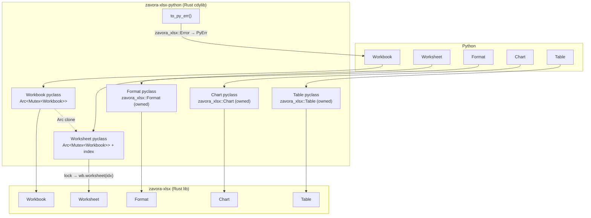

# Design Document: python-bindings

## Overview

This design describes `zavora-xlsx-python`, a Python extension module that wraps the `zavora-xlsx` Rust library using PyO3 (v0.22) and maturin. The module exposes five primary Python classes — `Workbook`, `Worksheet`, `Format`, `Chart`, and `Table` — that map to their Rust counterparts. The crate lives in `zavora-xlsx-python/` as a workspace member and compiles to a cdylib via `maturin develop` / `maturin build`.

The central design challenge is the same as the Node.js bindings: Rust's `Workbook` owns its `Worksheet` vec, but Python needs independent handles to worksheets that outlive any single method call. We solve this with `Arc<Mutex<Workbook>>` shared between the `Workbook` pyclass and every `Worksheet` pyclass it hands out. `Format`, `Chart`, and `Table` are value types — each Python instance owns its Rust struct directly.

Key differences from the Node.js bindings:
- PyO3 uses `#[pyclass]` / `#[pymethods]` instead of napi-rs `#[napi]`
- Format/Chart/Table use `&mut self` directly in `#[pymethods]` (no `RefCell` needed) — PyO3 manages the borrow through its GIL-based model
- For method chaining, builder methods take `slf: PyRefMut<'_, Self>` and return `PyRefMut<'_, Self>`
- Error handling maps `zavora_xlsx::Error` variants to specific Python exception types (`OSError`, `IndexError`, `ValueError`, `RuntimeError`)
- Binary data uses `PyBytes` / `&[u8]` instead of Node.js `Buffer`
- Dict-based APIs for properties, CSV options, and table columns (Python dicts instead of napi objects)

## Architecture



### Ownership Model

| Python Class | Rust Wrapper | Why |
|---|---|---|
| `Workbook` | `Arc<Mutex<zavora_xlsx::Workbook>>` | Shared with all Worksheet handles; Mutex for interior mutability |
| `Worksheet` | `Arc<Mutex<zavora_xlsx::Workbook>>` + `usize` (sheet index) | Borrows into the workbook on each method call via lock + index |
| `Format` | `zavora_xlsx::Format` (owned directly) | Value type, single owner. PyO3 `#[pymethods]` can take `&mut self` directly |
| `Chart` | `zavora_xlsx::Chart` (owned directly) | Value type, single owner |
| `Table` | `zavora_xlsx::Table` (owned directly) | Value type, single owner |

The `Arc<Mutex<>>` pattern for Workbook/Worksheet is necessary because:
1. PyO3 classes are moved into the Python GC — we cannot hand out Rust references with lifetimes
2. Multiple `Worksheet` Python objects may exist simultaneously, all pointing into the same workbook
3. The Mutex ensures safe concurrent access (PyO3 requires `Send` for `#[pyclass]`)

Unlike the Node.js bindings, `Format`, `Chart`, and `Table` do **not** need `RefCell`. PyO3's `#[pymethods]` support `&mut self` directly — the GIL ensures single-threaded access. For method chaining, builder methods take `slf: PyRefMut<'_, Self>` and return `PyRefMut<'_, Self>`, enabling `fmt.bold().italic()` in Python.

### Crate Layout

```
zavora-xlsx-python/
├── Cargo.toml          # cdylib, pyo3 0.22 + zavora-xlsx path dep
├── pyproject.toml      # maturin build backend
├── src/
│   ├── lib.rs          # #[pymodule] fn zavora_xlsx + module declarations
│   ├── workbook.rs     # Workbook pyclass
│   ├── worksheet.rs    # Worksheet pyclass
│   ├── format.rs       # Format pyclass
│   ├── chart.rs        # Chart pyclass
│   ├── table.rs        # Table pyclass
│   └── error.rs        # zavora_xlsx::Error → PyErr conversion
└── tests/
    └── test_basic.py   # Python integration tests
```

## Components and Interfaces

### error.rs — Error Conversion

```rust
use pyo3::exceptions::{PyIndexError, PyOSError, PyRuntimeError, PyValueError};
use pyo3::PyErr;

/// Convert a zavora_xlsx::Error into a PyErr, mapping to appropriate
/// Python exception types.
pub fn to_py_err(e: zavora_xlsx::Error) -> PyErr {
    match &e {
        zavora_xlsx::Error::Io(_) => PyOSError::new_err(format!("{e}")),
        zavora_xlsx::Error::SheetNotFound(_) => PyIndexError::new_err(format!("{e}")),
        zavora_xlsx::Error::InvalidData(_) => PyValueError::new_err(format!("{e}")),
        _ => PyRuntimeError::new_err(format!("{e}")),
    }
}

/// Shorthand: convert Result<T, zavora_xlsx::Error> to PyResult<T>.
pub trait IntoPy<T> {
    fn into_pyresult(self) -> pyo3::PyResult<T>;
}

impl<T> IntoPy<T> for Result<T, zavora_xlsx::Error> {
    fn into_pyresult(self) -> pyo3::PyResult<T> {
        self.map_err(to_py_err)
    }
}
```

### lib.rs — Module Entry Point

```rust
use pyo3::prelude::*;

mod error;
mod format;
mod chart;
mod table;
mod workbook;
mod worksheet;

/// The zavora_xlsx Python module.
#[pymodule]
fn zavora_xlsx(m: &Bound<'_, PyModule>) -> PyResult<()> {
    m.add_class::<workbook::Workbook>()?;
    m.add_class::<worksheet::Worksheet>()?;
    m.add_class::<format::Format>()?;
    m.add_class::<chart::Chart>()?;
    m.add_class::<table::Table>()?;
    Ok(())
}
```

### workbook.rs — Workbook pyclass

```rust
use std::sync::{Arc, Mutex};
use pyo3::prelude::*;
use pyo3::types::{PyBytes, PyDict};

#[pyclass]
pub struct Workbook {
    pub(crate) inner: Arc<Mutex<zavora_xlsx::Workbook>>,
}

#[pymethods]
impl Workbook {
    #[new]
    pub fn new() -> Self;

    #[staticmethod]
    pub fn open(path: &str) -> PyResult<Self>;

    #[staticmethod]
    pub fn open_from_bytes(data: &[u8]) -> PyResult<Self>;

    pub fn save(&self, path: &str) -> PyResult<()>;

    pub fn save_to_bytes<'py>(&self, py: Python<'py>) -> PyResult<Bound<'py, PyBytes>>;

    pub fn worksheet(&self, index: usize) -> PyResult<Worksheet>;

    pub fn add_worksheet(&self) -> PyResult<Worksheet>;

    pub fn add_worksheet_with_name(&self, name: &str) -> PyResult<Worksheet>;

    pub fn sheet_names(&self) -> PyResult<Vec<String>>;

    pub fn sheet_count(&self) -> PyResult<usize>;

    pub fn set_properties(&self, props: &Bound<'_, PyDict>) -> PyResult<()>;

    pub fn properties<'py>(&self, py: Python<'py>) -> PyResult<Bound<'py, PyDict>>;
}
```

### worksheet.rs — Worksheet pyclass

```rust
use std::sync::{Arc, Mutex};
use pyo3::prelude::*;
use pyo3::types::PyDict;

#[pyclass]
pub struct Worksheet {
    pub(crate) workbook: Arc<Mutex<zavora_xlsx::Workbook>>,
    pub(crate) index: usize,
}

#[pymethods]
impl Worksheet {
    // ── Cell writing ──

    #[pyo3(signature = (row, col, value, format=None))]
    pub fn write_string(&self, row: u32, col: u16, value: &str,
                        format: Option<&Format>) -> PyResult<()>;

    #[pyo3(signature = (row, col, value, format=None))]
    pub fn write_number(&self, row: u32, col: u16, value: f64,
                        format: Option<&Format>) -> PyResult<()>;

    #[pyo3(signature = (row, col, value, format=None))]
    pub fn write_boolean(&self, row: u32, col: u16, value: bool,
                         format: Option<&Format>) -> PyResult<()>;

    #[pyo3(signature = (row, col, formula, format=None))]
    pub fn write_formula(&self, row: u32, col: u16, formula: &str,
                         format: Option<&Format>) -> PyResult<()>;

    pub fn write_blank(&self, row: u32, col: u16, format: &Format) -> PyResult<()>;

    // ── Cell reading ──

    pub fn read_cell(&self, py: Python<'_>, row: u32, col: u16) -> PyResult<PyObject>;

    pub fn used_range<'py>(&self, py: Python<'py>) -> PyResult<Option<Bound<'py, PyDict>>>;

    // ── Layout ──

    pub fn set_column_width(&self, col: u16, width: f64) -> PyResult<()>;
    pub fn set_row_height(&self, row: u32, height: f64) -> PyResult<()>;
    pub fn set_freeze_panes(&self, row: u32, col: u16) -> PyResult<()>;

    #[pyo3(signature = (r1, c1, r2, c2, text, format=None))]
    pub fn merge_range(&self, r1: u32, c1: u16, r2: u32, c2: u16,
                       text: &str, format: Option<&Format>) -> PyResult<()>;

    pub fn autofit(&self) -> PyResult<()>;
    pub fn set_zoom(&self, percent: u16) -> PyResult<()>;

    // ── Features ──

    pub fn insert_chart(&self, row: u32, col: u16, chart: &Chart) -> PyResult<()>;
    pub fn add_table(&self, first_row: u32, first_col: u16, last_row: u32,
                     last_col: u16, table: &Table) -> PyResult<()>;

    // ── CSV export ──

    #[pyo3(signature = (options=None))]
    pub fn to_csv_string(&self, options: Option<&Bound<'_, PyDict>>) -> PyResult<String>;

    // ── Name ──

    pub fn name(&self) -> PyResult<String>;
    pub fn set_name(&self, name: &str) -> PyResult<()>;
}
```

### format.rs — Format pyclass

```rust
use pyo3::prelude::*;

#[pyclass]
pub struct Format {
    pub(crate) inner: zavora_xlsx::Format,
}

#[pymethods]
impl Format {
    #[new]
    pub fn new() -> Self {
        Self { inner: zavora_xlsx::Format::new() }
    }

    // Builder methods use PyRefMut for chaining.
    // Each method mutates inner and returns self.
    pub fn bold(mut slf: PyRefMut<'_, Self>) -> PyRefMut<'_, Self> {
        slf.inner = slf.inner.clone().bold();
        slf
    }

    pub fn italic(mut slf: PyRefMut<'_, Self>) -> PyRefMut<'_, Self> {
        slf.inner = slf.inner.clone().italic();
        slf
    }

    pub fn underline(mut slf: PyRefMut<'_, Self>, style: &str) -> PyRefMut<'_, Self>;
    pub fn strikethrough(mut slf: PyRefMut<'_, Self>) -> PyRefMut<'_, Self>;
    pub fn font_size(mut slf: PyRefMut<'_, Self>, size: f64) -> PyRefMut<'_, Self>;
    pub fn font_name(mut slf: PyRefMut<'_, Self>, name: &str) -> PyRefMut<'_, Self>;
    pub fn font_color(mut slf: PyRefMut<'_, Self>, hex: &str) -> PyRefMut<'_, Self>;
    pub fn background_color(mut slf: PyRefMut<'_, Self>, hex: &str) -> PyRefMut<'_, Self>;
    pub fn num_format(mut slf: PyRefMut<'_, Self>, format: &str) -> PyRefMut<'_, Self>;
    pub fn border(mut slf: PyRefMut<'_, Self>, style: &str) -> PyRefMut<'_, Self>;
    pub fn align(mut slf: PyRefMut<'_, Self>, alignment: &str) -> PyRefMut<'_, Self>;
    pub fn text_wrap(mut slf: PyRefMut<'_, Self>) -> PyRefMut<'_, Self>;
    pub fn shrink_to_fit(mut slf: PyRefMut<'_, Self>) -> PyRefMut<'_, Self>;
    pub fn indent(mut slf: PyRefMut<'_, Self>, level: u8) -> PyRefMut<'_, Self>;
    pub fn rotation(mut slf: PyRefMut<'_, Self>, angle: i16) -> PyRefMut<'_, Self>;
}
```

The `PyRefMut` pattern enables Python-side chaining:
```python
fmt = Format().bold().italic().font_size(14)
```

Internally, each builder method clones the core `Format`, applies the builder call, and stores the result back. This is necessary because the core `Format` builder methods consume `self` (take ownership). The clone cost is negligible — `Format` is a small struct.

### chart.rs — Chart pyclass

```rust
use pyo3::prelude::*;

#[pyclass]
pub struct Chart {
    pub(crate) inner: zavora_xlsx::Chart,
}

#[pymethods]
impl Chart {
    #[new]
    pub fn new(chart_type: &str) -> PyResult<Self>;

    pub fn add_series(mut slf: PyRefMut<'_, Self>, values: &str,
                      categories: Option<&str>,
                      name: Option<&str>) -> PyRefMut<'_, Self>;

    pub fn set_title(mut slf: PyRefMut<'_, Self>, title: &str) -> PyRefMut<'_, Self>;
    pub fn set_x_axis_name(mut slf: PyRefMut<'_, Self>, name: &str) -> PyRefMut<'_, Self>;
    pub fn set_y_axis_name(mut slf: PyRefMut<'_, Self>, name: &str) -> PyRefMut<'_, Self>;
    pub fn set_size(mut slf: PyRefMut<'_, Self>, width: u32, height: u32) -> PyRefMut<'_, Self>;
    pub fn set_legend_position(mut slf: PyRefMut<'_, Self>, position: &str) -> PyRefMut<'_, Self>;
}
```

**Chart type string mapping:**

| Python string | Rust `ChartType` |
|---|---|
| `"bar"` | `ChartType::Bar` |
| `"column"` | `ChartType::Column` |
| `"line"` | `ChartType::Line` |
| `"pie"` | `ChartType::Pie` |
| `"scatter"` | `ChartType::Scatter` |
| `"area"` | `ChartType::Area` |
| `"doughnut"` | `ChartType::Doughnut` |
| `"radar"` | `ChartType::Radar` |

Unrecognized strings raise `ValueError`.

### table.rs — Table pyclass

```rust
use pyo3::prelude::*;
use pyo3::types::PyList;

#[pyclass]
pub struct Table {
    pub(crate) inner: zavora_xlsx::Table,
}

#[pymethods]
impl Table {
    #[new]
    pub fn new() -> Self;

    pub fn set_columns(mut slf: PyRefMut<'_, Self>,
                       columns: &Bound<'_, PyList>) -> PyResult<PyRefMut<'_, Self>>;

    pub fn set_style(mut slf: PyRefMut<'_, Self>, style: &str) -> PyRefMut<'_, Self>;
    pub fn set_total_row(mut slf: PyRefMut<'_, Self>, enabled: bool) -> PyRefMut<'_, Self>;
    pub fn set_autofilter(mut slf: PyRefMut<'_, Self>, enabled: bool) -> PyRefMut<'_, Self>;
    pub fn set_name(mut slf: PyRefMut<'_, Self>, name: &str) -> PyRefMut<'_, Self>;
}
```

The `set_columns` method accepts a Python list of dicts:
```python
table.set_columns([
    {"name": "Product", "total_label": "Total"},
    {"name": "Qty", "total_function": "sum"},
    {"name": "Price", "total_function": "sum"},
])
```

Each dict is extracted with `get_item("name")`, `get_item("total_label")`, `get_item("total_function")` and converted to `zavora_xlsx::TableColumn`.

## Data Models

### CellValue Mapping (Rust → Python)

| Rust `CellValue` | Python value | Notes |
|---|---|---|
| `CellValue::String(s)` | `str` | Direct mapping |
| `CellValue::Number(n)` | `float` | f64 → Python float |
| `CellValue::Bool(b)` | `bool` | Direct mapping |
| `CellValue::Empty` | `None` | Represents blank cells |
| `CellValue::DateTime(dt)` | `float` | Excel serial date as f64 |
| `CellValue::Error(e)` | `str` | Error string like `"#REF!"` |
| `CellValue::Formula { formula, cached_value }` | `dict` | `{"formula": str, "cached_value": str \| float \| bool \| None}` |
| `CellValue::RichText(rt)` | `str` | Plain text extraction via `rt.plain_text()` |

The `read_cell` method returns a `PyObject` which can be any of the above types. The conversion function:

```rust
fn cell_value_to_py(py: Python<'_>, value: &zavora_xlsx::CellValue) -> PyObject {
    match value {
        CellValue::Empty => py.None(),
        CellValue::String(s) => s.into_pyobject(py).unwrap().into_any().unbind(),
        CellValue::Number(n) => n.into_pyobject(py).unwrap().into_any().unbind(),
        CellValue::Bool(b) => b.into_pyobject(py).unwrap().into_any().unbind(),
        CellValue::DateTime(dt) => dt.serial().into_pyobject(py).unwrap().into_any().unbind(),
        CellValue::Error(e) => e.into_pyobject(py).unwrap().into_any().unbind(),
        CellValue::RichText(rt) => rt.plain_text().into_pyobject(py).unwrap().into_any().unbind(),
        CellValue::Formula { formula, cached_value } => {
            let dict = PyDict::new(py);
            dict.set_item("formula", formula).unwrap();
            dict.set_item("cached_value", cell_value_to_py(py, cached_value)).unwrap();
            dict.into_any().unbind()
        }
    }
}
```

### Document Properties (Python dict)

```python
# Setting properties
wb.set_properties({
    "title": "My Report",
    "author": "Alice",
    "subject": "Q4 Results",
    "description": "Quarterly financial report",
    "keywords": "finance, quarterly",
    "category": "Reports",
    "company": "Acme Corp",
})

# Getting properties — returns dict with same keys
props = wb.properties()
```

All keys are optional. Unknown keys are silently ignored.

### CSV Options (Python dict)

```python
csv = ws.to_csv_string({
    "delimiter": "\t",      # Single character, default ","
    "quote": "'",            # Single character, default '"'
    "line_ending": "\n",     # Default "\r\n"
    "date_format": "mm/dd/yyyy",  # Default "yyyy-mm-dd"
})
```

The `delimiter` and `quote` strings are converted to `u8` by taking the first byte. Empty strings raise `ValueError`.

### String-to-Enum Mappings

**Border styles:** `"none"`, `"thin"`, `"medium"`, `"thick"`, `"double"`, `"dashed"`, `"dotted"` → `BorderStyle::*`

**Underline styles:** `"single"`, `"double"` → `Underline::*`

**Alignment:** `"left"`, `"center"`, `"right"`, `"fill"`, `"justify"`, `"top"`, `"middle"`, `"bottom"` → `Align::*`

**Legend position:** `"bottom"`, `"top"`, `"left"`, `"right"`, `"none"` → `LegendPosition::*`

**Table style:** Parsed from strings like `"TableStyleLight1"`, `"TableStyleMedium5"`, `"TableStyleDark3"` → `TableStyle::Light(1)`, `TableStyle::Medium(5)`, `TableStyle::Dark(3)`


## Correctness Properties

*A property is a characteristic or behavior that should hold true across all valid executions of a system — essentially, a formal statement about what the system should do. Properties serve as the bridge between human-readable specifications and machine-verifiable correctness guarantees.*

### Property 1: Cell write/read round-trip

*For any* cell value type (string, number, boolean, or formula) and any valid (row, col) position, writing the value to a worksheet cell and then reading it back with `read_cell` should return an equivalent value: strings match exactly, numbers match exactly, booleans match exactly, and formulas return a dict whose `"formula"` key matches the written formula string.

**Validates: Requirements 4.1, 4.2, 4.3, 4.4, 5.1, 5.2, 5.3, 5.5**

### Property 2: Buffer save/load round-trip

*For any* workbook containing arbitrary cell data (strings, numbers, booleans) across one or more worksheets, calling `save_to_bytes()` and then `Workbook.open_from_bytes()` on the resulting bytes should produce a workbook where every previously written cell returns the same value via `read_cell`.

**Validates: Requirements 2.3, 2.7**

### Property 3: add_worksheet increments sheet count

*For any* positive integer N, starting from a new workbook (sheet_count = 1) and calling `add_worksheet()` N times should result in `sheet_count()` returning exactly 1 + N.

**Validates: Requirements 3.3, 3.6**

### Property 4: Worksheet name round-trip

*For any* valid Excel sheet name (1–31 characters, no `:/\?*[]` characters), both creating a worksheet with `add_worksheet_with_name(name)` and renaming an existing worksheet with `set_name(name)` should result in `name()` returning exactly the provided name, and `sheet_names()` including that name.

**Validates: Requirements 3.4, 3.5, 13.1, 13.2**

### Property 5: used_range encompasses all written cells

*For any* non-empty set of (row, col) positions where values have been written, `used_range()` should return a dict where `first_row <= min(rows)`, `first_col <= min(cols)`, `last_row >= max(rows)`, and `last_col >= max(cols)`.

**Validates: Requirements 5.6**

### Property 6: Format builder methods are chainable

*For any* sequence of Format builder method calls (drawn from `bold`, `italic`, `font_size`, `font_name`, `font_color`, `background_color`, `num_format`, `text_wrap`, `shrink_to_fit`), each call should return the same Format instance, enabling `Format().bold().italic().font_size(14)` style chaining without errors.

**Validates: Requirements 6.2, 6.3**

### Property 7: Invalid chart type string raises ValueError

*For any* string that is not one of the 8 recognized chart type strings (`"bar"`, `"column"`, `"line"`, `"pie"`, `"scatter"`, `"area"`, `"doughnut"`, `"radar"`), calling `Chart(type)` should raise a Python `ValueError`.

**Validates: Requirements 7.5**

### Property 8: Document properties round-trip

*For any* set of document property strings (title, author, subject, description, keywords, category, company), calling `set_properties(props)` and then `properties()` should return a dict with the same field values.

**Validates: Requirements 10.1, 10.2**

### Property 9: Rust errors produce non-empty Python exception messages

*For any* operation that triggers a Rust `zavora_xlsx::Error` (e.g., opening a non-existent file, opening invalid bytes, accessing an out-of-bounds sheet index), the resulting Python exception should have a non-empty message string containing descriptive text from the original Rust error.

**Validates: Requirements 2.4, 2.5, 11.1, 11.2**

### Property 10: CSV export contains all written cell values

*For any* grid of string cell values written to a worksheet, calling `to_csv_string()` should produce a string that contains every written string value as a substring (accounting for CSV escaping of values containing delimiters or quotes).

**Validates: Requirements 12.1**

### Property 11: Invalid sheet name raises ValueError

*For any* string containing characters from the set `:/\?*[]` or exceeding 31 characters, calling `set_name(name)` should raise a Python `ValueError`.

**Validates: Requirements 13.3**

## Error Handling

### Error Conversion Strategy

All Rust errors from `zavora_xlsx::Error` are converted to Python exceptions via a centralized `to_py_err()` function. The conversion maps error variants to appropriate Python exception types and preserves the original error message using the `Display` implementation.

```rust
pub fn to_py_err(e: zavora_xlsx::Error) -> PyErr {
    match &e {
        zavora_xlsx::Error::Io(_) => PyOSError::new_err(format!("{e}")),
        zavora_xlsx::Error::SheetNotFound(_) => PyIndexError::new_err(format!("{e}")),
        zavora_xlsx::Error::InvalidData(_) => PyValueError::new_err(format!("{e}")),
        _ => PyRuntimeError::new_err(format!("{e}")),
    }
}
```

### Error Categories

| Rust Error Variant | Python Exception | Example Trigger |
|---|---|---|
| `Error::Io(e)` | `OSError` with `"IO error: ..."` | File not found, permission denied |
| `Error::Zip(e)` | `RuntimeError` with `"ZIP error: ..."` | Corrupt xlsx buffer |
| `Error::Xml(e)` | `RuntimeError` with `"XML error: ..."` | Malformed xlsx content |
| `Error::SheetNotFound(s)` | `IndexError` with `"Sheet not found: ..."` | Out-of-bounds worksheet index |
| `Error::InvalidData(s)` | `ValueError` with `"Invalid data: ..."` | Duplicate sheet name, invalid sheet name |
| `Error::ReadOnly` | `RuntimeError` with `"Workbook is read-only"` | Modifying a read-only workbook |
| PyO3 type mismatch | `TypeError` (automatic) | Passing string where number expected |

### Error Handling Patterns

1. **Result conversion**: Every method that calls into `zavora_xlsx` uses the `IntoPy` trait extension to convert `Result<T, zavora_xlsx::Error>` to `PyResult<T>`.

2. **Mutex poisoning**: If the `Mutex` is poisoned (shouldn't happen under normal Python usage), the lock attempt returns a `PyRuntimeError` with a "lock poisoned" message.

3. **String-to-enum conversion**: Invalid strings for chart types produce `PyValueError` listing valid options. Invalid border styles and alignment strings fall back to defaults (matching the Node.js bindings behavior).

4. **Argument validation**: PyO3 handles type checking automatically. Additional validation (e.g., empty delimiter string for CSV options) is done in the Rust wrapper before calling into the core library, raising `PyValueError`.

5. **Dict key extraction**: When extracting keys from Python dicts (properties, CSV options, table columns), missing optional keys are treated as `None`. Invalid key types raise `TypeError` via PyO3's automatic conversion.

## Testing Strategy

### Dual Testing Approach

The testing strategy combines property-based tests for universal correctness guarantees with example-based tests for specific scenarios and integration verification.

### Property-Based Tests (Rust)

Property-based tests will be written in Rust using the `proptest` crate, testing the binding logic (CellValue conversion, error mapping, round-trip behavior) through the core API without requiring a Python runtime.

**Configuration:**
- Minimum 100 iterations per property test
- Each test tagged with: `Feature: python-bindings, Property {N}: {description}`

**Properties to implement:**
1. Cell write/read round-trip (Property 1) — generate random strings, f64 numbers, booleans; write via the core API, read back, verify equality
2. Buffer save/load round-trip (Property 2) — generate random cell grids, save to buffer, reload, verify all cells match
3. add_worksheet count invariant (Property 3) — generate random N, add N worksheets, verify count
4. Worksheet name round-trip (Property 4) — generate valid sheet names, create/rename worksheet, verify name
5. used_range bounds (Property 5) — generate random (row, col) sets, write values, verify used_range encompasses all
6. Format chainability (Property 6) — generate random sequences of builder calls, verify no panics
7. Invalid chart type rejection (Property 7) — generate arbitrary strings not in the valid set, verify error
8. DocProperties round-trip (Property 8) — generate random property strings, set/get, verify equality
9. Error message non-emptiness (Property 9) — trigger various error conditions, verify message is non-empty
10. CSV export completeness (Property 10) — generate random string grids, export to CSV, verify all values present
11. Invalid sheet name rejection (Property 11) — generate strings with forbidden characters, verify error

### Example-Based Tests (Python)

Integration tests in `tests/test_basic.py` using `pytest`:

- **Workbook lifecycle**: `Workbook()`, `Workbook.open()`, `save()`, `save_to_bytes()`, `Workbook.open_from_bytes()`
- **Worksheet access**: `worksheet(0)`, `add_worksheet()`, `sheet_names()`, `sheet_count()`
- **Cell operations**: write/read each type, `write_blank`, `used_range` on empty sheet returns `None`
- **Format application**: create format with chained methods, pass to write methods
- **Chart creation**: create each chart type, add series, insert into worksheet
- **Table creation**: create table with columns dict list, set style, add to worksheet
- **Layout methods**: `set_column_width`, `set_row_height`, `set_freeze_panes`, `merge_range`, `autofit`, `set_zoom`
- **CSV export**: default options, custom delimiter via dict, empty worksheet
- **Error cases**: invalid file path → `OSError`, invalid buffer → exception, out-of-bounds index → `IndexError`, invalid chart type → `ValueError`, invalid sheet name → `ValueError`
- **Document properties**: set and retrieve properties via dicts

### Test File Structure

```
zavora-xlsx-python/
├── src/          # Rust source with #[cfg(test)] property tests
├── tests/
│   └── property_tests.rs   # Rust property-based tests using proptest
└── tests/
    └── test_basic.py        # Python integration tests (pytest)
```
